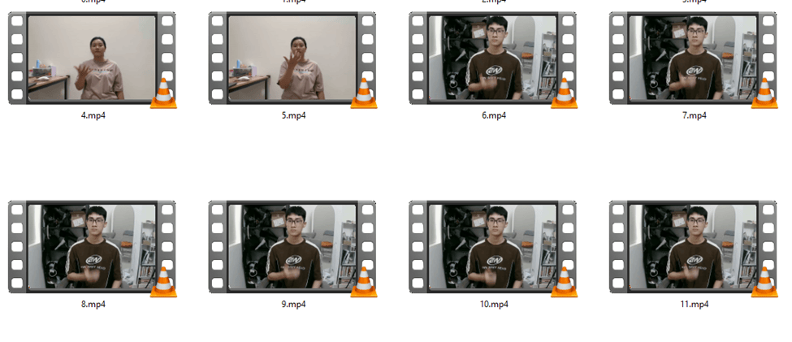
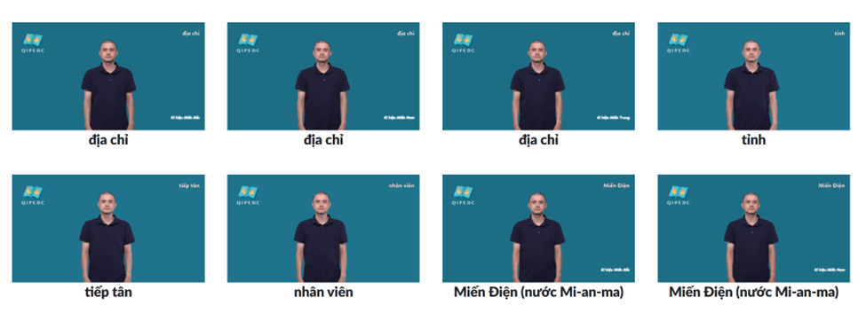
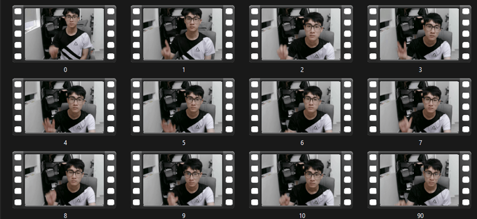

# SPOTER+ (Customized): Word-level Sign Language Recognition

## Introduction

SPOTER (Sign Pose-based Transfomer) is a Transformer-based framework for recognizing isolated sign language words using skeletal pose data. Designed for lightweight deployment on handheld devices, SPOTER achieves state-of-the-art accuracy on benchmarks like WLASL100 and LSA64 by modeling temporal and spatial dependencies in pose sequences.

## Improvements

- **Reduced parameter count**: The original SPOTER model with 6 M parameters is prone to overfitting. We redesigned the transformer to use only 900 K parameters while maintaining the same accuracy.
- **Extended frame window**: Signers perform gestures at different speeds. By increasing the number of intermediate frames around the gesture’s midpoint, we better capture these temporal variations.
- **Hand rotation augmentation**: We simulate various hand rotations to account for different signing angles and orientations.
- **Frame redundancy removal**: Since classification relies solely on sign gestures, non-informative frames (e.g., simple hand raises and lowers) are discarded to improve model focus and performance.


## Improvement Results

| Method                         | WLASL100 Accuracy | LSA64 Accuracy |
|--------------------------------|-------------------|----------------|
| Baseline SPOTER                | 63.18%            | 100%           |
| Reduced parameter count        | 64.05%            | 100%           |
| Extended frame window          | 69.84%            | 100%           |
| Hand rotation augmentation     | 65.93%            | 100%           |
| Data preprocessing             | 72.47%            | 100%           |
| Combined all improvements      | 76.74%            | 100%           |


## Get Started


1. **Install dependencies**
```bash
 pip install -r requirements.txt
 ```
- Install mediapipe separately to avoid library conflicts:
```bash
 pip install mediapipe
 ```
2. **Traning model**
- To train the model, simply specify the hyperparameters and run the following:
```bash

python -m train --experiment_name "my_experiment" --epochs 200 --lr 0.001 --training_set_path "data/train.csv" --validation_set_path "data/test1.csv" --testing_set_path "data/test2.csv" --num_classes 100
```

3. **Extract keypoints**
- Run the `build_data.py` script and update the paths to match your data:
- The folder structure under `--input-dir` will look like
```text
<input-dir>/
├── 0/
│   ├── video1.mp4
│   ├── video2.mp4
│   └── ...
├── 1/
├── 2/
└── ...
```
## Data

As SPOTER works on top of sequences of signers' skeletal data extracted from videos, we wanted to eliminate the computational demands of such annotation for each training run by pre-collecting this. For reproducibility, we are open-sourcing this data for WLASL100 and LSA64 datasets. You can find the data [here](https://github.com/maty-bohacek/spoter/releases/tag/supplementary-data).

**Original video datasets:**
- **WLASL videos**: [https://dxli94.github.io/WLASL/](https://dxli94.github.io/WLASL/)
- **LSA64 videos**: [https://facundoq.github.io/datasets/lsa64/](https://facundoq.github.io/datasets/lsa64/)

## Vietnamese Sign Language
With the goal of creating a sign language recognition model for Vietnamese, our research team recorded 1,500 videos covering 100 words for training, and tested using the government dataset: [QIPEDC Dictionary](https://qipedc.moet.gov.vn/dictionary)

### Data Split
- **Train set**: Videos recorded by our team for training purposes.  
  
- **Test1 set**: Videos performed by sign language experts to evaluate model performance.  
  
- **Test2 set**: Videos recorded by our team at different times to assess model robustness over time.  
  

### Results
- **Test1 set accuracy**: 90%
- **Test2 set accuracy**: 96%

To obtain the Vietnamese-Sign-Language keypoint data, please visit: [Google Drive Keypoints](https://drive.google.com/file/d/1wBC214-6rjHB-QuWl6GWuuFpdT28xppV/view?usp=sharing)
<br>To obtain the raw video data, please contact us via the information below.

## Contact

If you have any questions, feedback, or contributions, feel free to reach out:

- **Nguyen Nhat Tan**  
  📧 [tannguyennhat2024@gmail.com](mailto:tannguyennhat2024@gmail.com)  


- **Nguyen Duc Kha**  
  📧 [hongphtn@gmail.com](mailto:hongphtn@gmail.com)
## License

- **Code**: Apache License 2.0 (permissive for commercial use)
- **Data**: CC BY-NC 4.0 (for non-commercial research use)


## Citation


```bibtex
@inproceedings{bohacek2022soter,
  title={SPOTER: Sign Pose-based Transformer for Word-level Sign Language Recognition},
  author={Boh{\'a}\v{c}ek, Maty{\'a}\v{u}s and Hr{\'u}z, Marek},
  booktitle={WACV Workshops},
  year={2022}
}
```

